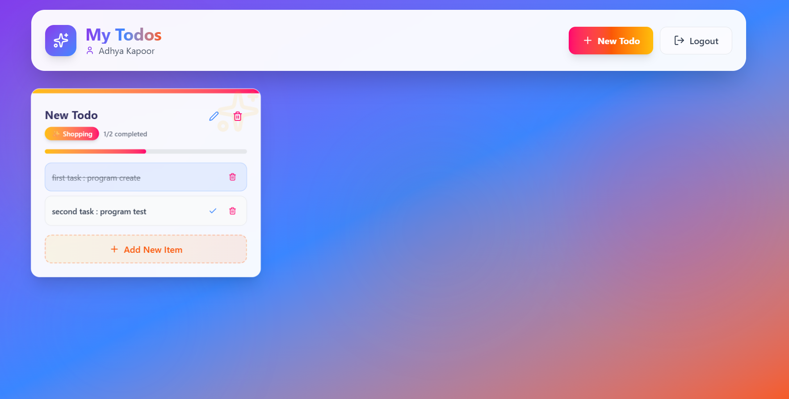
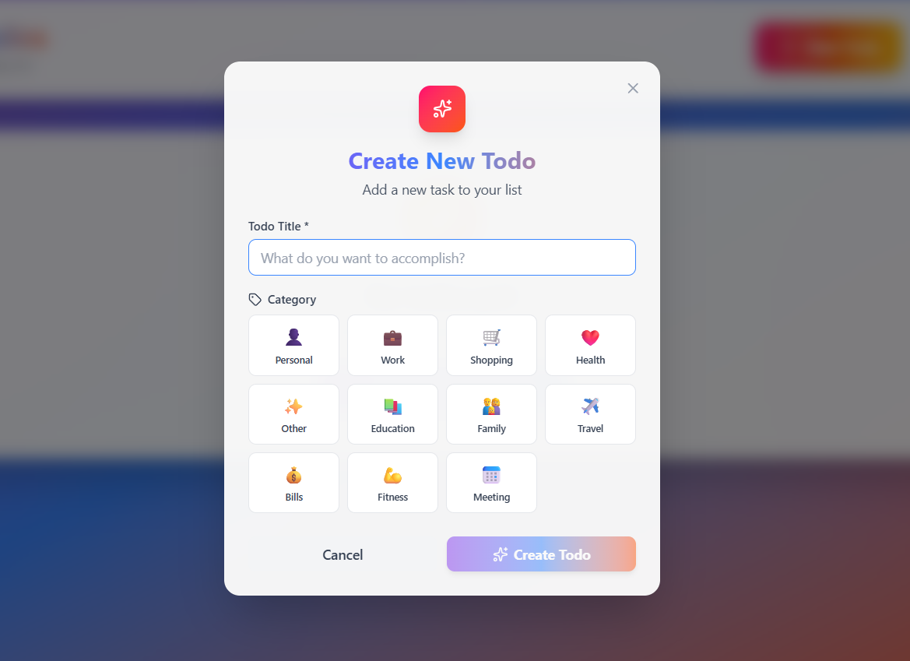
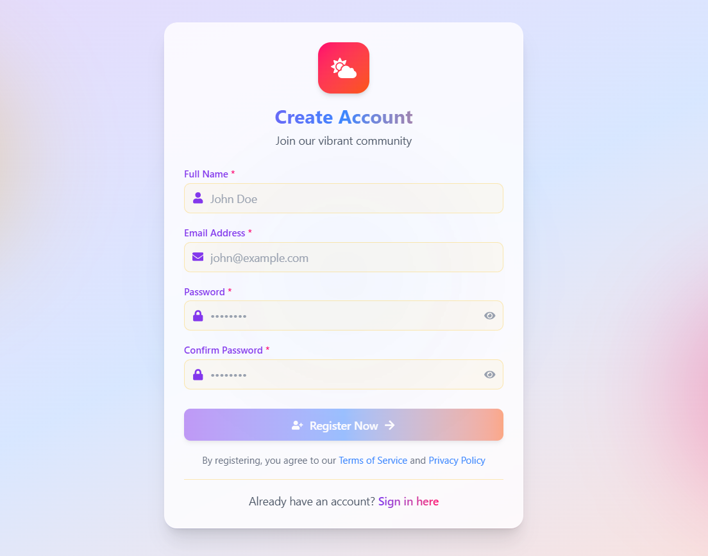
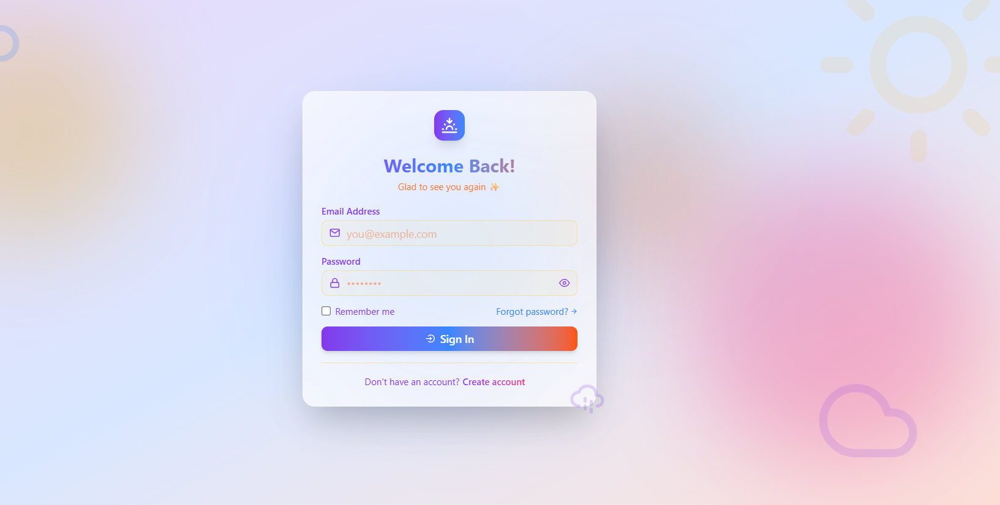

# 📝 Todo App

A modern full-stack Todo application built with React, Node.js, and MongoDB. It features secure JWT authentication, Google OAuth login, profile image uploads, and complete Todo management functionality.

---

## ✨ Features

### Authentication & Security

* JWT-based authentication
* Secure HTTP-only cookies
* Google OAuth 2.0 login
* Password hashing with bcrypt
* Protected routes and middleware

### Todo Management

* Create new todos
* View all todos
* Update existing todos
* Delete todos
* Mark todos as completed

### User Profile

* Profile image upload
* Cloudinary image storage
* User account management

### User Experience

* Responsive design
* Modern UI with Tailwind CSS
* Toast notifications
* Fast Vite-powered frontend
* Loading states and error handling

---

## 🛠️ Tech Stack

### Frontend

| Technology          | Purpose          |
| ------------------- | ---------------- |
| React 19            | UI Library       |
| React Router DOM v7 | Routing          |
| Tailwind CSS v4     | Styling          |
| Axios               | API Requests     |
| React Toastify      | Notifications    |
| Lucide React        | Icons            |
| React Icons         | Additional Icons |
| Vite                | Build Tool       |

### Backend

| Technology       | Purpose               |
| ---------------- | --------------------- |
| Node.js          | Runtime               |
| Express 5        | Server Framework      |
| MongoDB          | Database              |
| Mongoose         | ODM                   |
| JWT              | Authentication        |
| Passport.js      | OAuth Authentication  |
| Google OAuth 2.0 | Social Login          |
| Cloudinary       | Image Storage         |
| Multer           | File Uploads          |
| bcryptjs         | Password Hashing      |
| Cookie Parser    | Cookie Management     |
| CORS             | Cross-Origin Requests |

---

## 📂 Project Structure

```bash
todo-app/
│
├── client/
│   ├── src/
│   ├── public/
│   └── package.json
│
├── server/
│   ├── src/
│   ├── uploads/
│   └── package.json
│
└── README.md
```

---

## ⚙️ Environment Variables

### Backend (.env)

```env
PORT=8000

MONGODB_URI=

JWT_SECRET=
JWT_EXPIRES_IN=

GOOGLE_CLIENT_ID=
GOOGLE_CLIENT_SECRET=
GOOGLE_CALLBACK_URL=

CLOUDINARY_CLOUD_NAME=
CLOUDINARY_API_KEY=
CLOUDINARY_API_SECRET=

CLIENT_URL=http://localhost:5173
```

### Frontend (.env)

```env
VITE_API_URL=http://localhost:8000/api/v1
```

---

## 🚀 Installation

### Clone Repository

```bash
git clone https://github.com/your-username/todo-app.git
cd todo-app
```

### Install Dependencies

#### Backend

```bash
cd server
npm install
```

#### Frontend

```bash
cd client
npm install
```

---

## ▶️ Running Locally

### Start Backend

```bash
cd server
npm run dev
```

### Start Frontend

```bash
cd client
npm run dev
```

Application URLs:

```bash
Frontend: http://localhost:5173
Backend:  http://localhost:8000
```

---

## 🔑 Authentication Flow

### Email & Password Login

1. Register a new account
2. Login using credentials
3. Receive JWT authentication
4. Access protected routes

### Google OAuth Login

1. Click "Continue with Google"
2. Complete Google authentication
3. Automatically create/login account
4. Redirect to dashboard

---

## 📸 Screenshots

### Dashboard



### Create Todo



### Register



### Login



---

## 📡 API Endpoints

### Authentication

```http
POST   /api/v1/auth/register
POST   /api/v1/auth/login
POST   /api/v1/auth/logout
GET    /api/v1/auth/google
GET    /api/v1/auth/google/callback
```

### Todos

```http
GET     /api/v1/todos
POST    /api/v1/todos
PATCH   /api/v1/todos/:id
DELETE  /api/v1/todos/:id
```

### User

```http
GET    /api/v1/users/profile
PATCH  /api/v1/users/profile
```

---

## 🚢 Deployment

### Frontend

* Vercel
* Netlify

### Backend

* Railway
* Render
* VPS

### Database

* MongoDB Atlas

---

## 🧪 Available Scripts

### Frontend

```bash
npm run dev
npm run build
```

### Backend

```bash
npm run dev
```

---

## 🤝 Contributing

Contributions are welcome.

1. Fork the repository
2. Create a feature branch

```bash
git checkout -b feature/new-feature
```

3. Commit changes

```bash
git commit -m "Add new feature"
```

4. Push to branch

```bash
git push origin feature/new-feature
```

5. Open a Pull Request

---

## 📄 License

This project is licensed under the MIT License.

---

## 👨‍💻 Author

Developed by **Laxman Shinde**

If you found this project helpful, consider giving it a ⭐ on GitHub.
